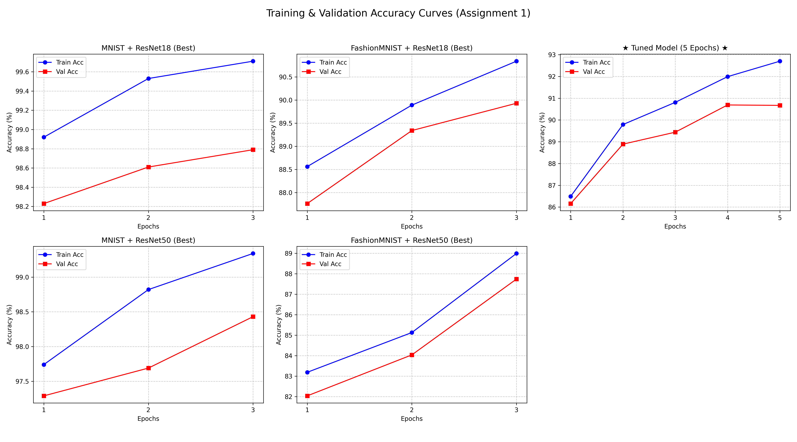
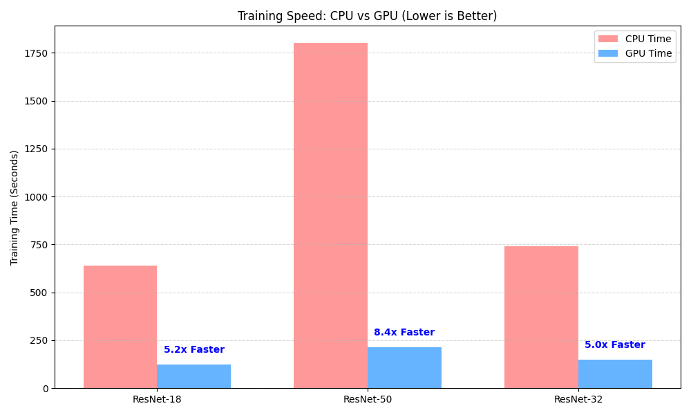

# ML-DL-Ops Assignment 1

**Name:** Jyoti Dwivedi  
**Roll Number:** M25CSA010  
**Colab Notebook Link:** https://colab.research.google.com/drive/1nj5mUZXJ8MpkcqsdxYaNwKfu0l_nnA__?usp=sharing

---

## Q1(a). Deep Learning on MNIST & FashionMNIST
Implemented ResNet-18 and ResNet-50 on both datasets with a 70-10-20 split.(train-val-test)

### 1. MNIST Results (Test Classification Accuracy)
| Batch Size | Optimizer | Learning Rate | ResNet-18 Acc (%) | ResNet-50 Acc (%) |
| :--- | :--- | :--- | :--- | :--- |
| 16 | SGD | 0.001 | 98.81% | 98.22% |
| 16 | SGD | 0.0001 | 98.26% | 97.13% |
| 16 | Adam | 0.001 | 98.85% | 98.09% |
| 16 | Adam | 0.0001 | 98.08% | 97.72% |
| 32 | SGD | 0.001 | **98.93%** | **98.36%** |
| 32 | SGD | 0.0001 | 97.59% | 95.02% |
| 32 | Adam | 0.001 | 98.72% | 98.15% |
| 32 | Adam | 0.0001 | 98.56% | 96.71% |

### 2. FashionMNIST Results (Test Classification Accuracy)
| Batch Size | Optimizer | Learning Rate | ResNet-18 Acc (%) | ResNet-50 Acc (%) |
| :--- | :--- | :--- | :--- | :--- |
| 16 | SGD | 0.001 | 90.20% | **87.96%** |
| 16 | SGD | 0.0001 | 88.26% | 82.49% |
| 16 | Adam | 0.001 | 88.89% | 86.42% |
| 16 | Adam | 0.0001 | 89.23% | 86.04% |
| 32 | SGD | 0.001 | 88.38% | 86.82% |
| 32 | SGD | 0.0001 | 87.74% | 80.21% |
| 32 | Adam | 0.001 | **89.39%** | 87.04% |
| 32 | Adam | 0.0001 | 89.16% | 85.12% |

### Results Table (Best Test Accuracy)
| Dataset | Model | Best Optimizer | Best Acc (%) |
| :--- | :--- | :--- | :--- |
| **MNIST** | ResNet-18 | SGD | **98.93%** |
| **MNIST** | ResNet-50 | SGD | 98.36% |
| **FashionMNIST** | ResNet-18 | Adam | **90.29%** (Tuned) |
| **FashionMNIST** | ResNet-50 | SGD | 87.96% |

> **Note:** The **Hyperparameter Tuned Model** is the overall best model. The other results listed above represent the best model found for that specific configuration (Dataset + Architecture) during the standard training and testing phase.

### Training Graphs
Below are the training and validation accuracy curves for all models, including the hyperparameter tuned run.

**Analysis:**
* **ResNet-18** consistently outperformed ResNet-50 on FashionMNIST, likely because ResNet-50 is too complex (over-parameterized) for such small images, leading to overfitting.
* **Hyperparameter Tuning** (increasing epochs to 5) improved the FashionMNIST ResNet-18 accuracy to **90.29%**.

---

## Q1(b). SVM Classification
Trained Support Vector Machines (SVM) with RBF and Polynomial kernels.

| Dataset | Kernel | Test Accuracy | Training Time |
| :--- | :--- | :--- | :--- |
| MNIST | rbf | 97.85% | 163.5s |
| MNIST | poly | 98.25% | 105.4s |
| FashionMNIST | rbf | 88.52% | 236.4s |
| FashionMNIST | poly | 89.34% | 195.1s |

**Observation:** SVM achieves high accuracy (98% on MNIST) but is significantly slower to train on large datasets compared to CNNs on GPU.

---

## Q2. Compute Benchmarking (CPU vs GPU)
Comparison of training time and performance on FashionMNIST (2 Epochs).

### Speedup Visualization

### Detailed Metrics
| Compute | Model | Optimizer | Accuracy | Time (ms) | FLOPs (G) |
| :--- | :--- | :--- | :--- | :--- | :--- |
| **CPU** | ResNet-18 | SGD | 88.20% | 638,715 | 0.035 |
| **GPU** | ResNet-18 | SGD | 88.84% | 123,926 | 0.035 |
| **CPU** | ResNet-32 | SGD | 89.25% | 741,592 | 0.070 |
| **GPU** | ResNet-32 | SGD | 90.25% | 149,280 | 0.070 |
| **CPU** | ResNet-50 | SGD | 85.18% | 1,800,461 | 0.082 |
| **GPU** | ResNet-50 | SGD | 86.40% | 214,194 | 0.082 |
| **CPU** | ResNet-18 | Adam | 88.99% | 855,215 | 0.035 |
| **GPU** | ResNet-18 | Adam | 88.12% | 136,046 | 0.035 |
| **CPU** | ResNet-32 | Adam | 89.21% | 744,994 | 0.070 |
| **GPU** | ResNet-32 | Adam | 89.65% | 153,516 | 0.070 |
| **CPU** | ResNet-50 | Adam | 84.47% | 2,019,986 | 0.082 |
| **GPU** | ResNet-50 | Adam | 80.61% | 239,549 | 0.082 |

**Analysis:**
* **GPU Speedup:** Training on GPU was approximately **5.2x faster** for ResNet-18 and **8.4x faster** for ResNet-50, whereas **5.0x faster** for ResNet-32 compared to CPU.
* **Model Efficiency:** ResNet-32 (designed for CIFAR-style 32x32 images) achieved the highest accuracy (**90.25%**) while having fewer FLOPs than ResNet-50.
